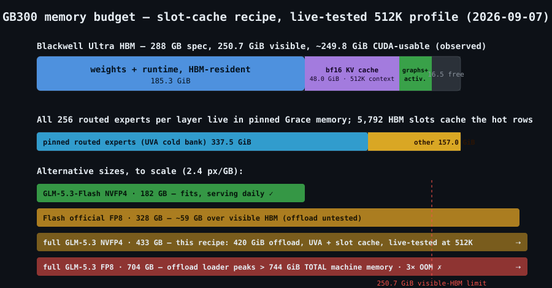

# GLM-5.3-NVFP4-One-GB300

**Status: experimental** · V1 baseline 33.8 tok/s C1 · sc13g slot-cache 43.1 tok/s C1 / 92.0 agg C4 / 95.6 agg C8 · MTP(1) audited as faster but **not** a quality-approved default · DFlash2-over-UVA, PR #1 demand-fill DMA, offline cache-policy reallocation, and simple trace prediction all failed their frozen continue gates · daily serving profile remains 512K context / 48 GiB bf16 KV with MTP(1)



## What this runs

Full GLM-5.3 NVFP4 on a single DGX Station GB300 with vLLM 0.28 UVA offload. The baseline (`scripts/launch-bigv1.sh`) keeps routed experts in coherent host memory and reserves an 8 GiB bf16 KV cache for a 65k context. The slot-cache variant (`scripts/launch-slotcache-portable.sh`) offloads all routed experts, then caches selected expert rows in HBM slots per MoE layer.

This is a research recipe, not a production recipe. The best non-MTP slot-cache run imported here (`sc13g`) is faster than the V1 baseline and has measured prefill parity plus diagnostic greedy equivalence, but decode noninferiority is **not** formally established. The known `tf_decode.py` metric is insufficient for promotion because common-prefix censoring, missing-piece handling, null logprob handling, category coverage, and statistical floor are incomplete.

## Hardware

Profile: [`hardware/dgx-station-gb300.yaml`](../../../hardware/dgx-station-gb300.yaml). Snapshot used by the recipe: [`results/2026-09-05-v1-baseline/system.json`](results/2026-09-05-v1-baseline/system.json), collected `2026-09-06T14:34:11Z`; do not treat that collection time as the historical benchmark start time.

| item | observed |
|---|---|
| Compute GPU | NVIDIA GB300, 250.7 GiB visible |
| Display GPU present | NVIDIA RTX PRO 4000 Blackwell SFF Edition, 23.9 GiB |
| Host | Grace / Neoverse-V2, 494.5 GiB host memory, aarch64 |
| OS / kernel / driver / CUDA | Ubuntu 24.04.4 · 6.17.0-1031-nvidia-64k · 595.84 · 13.2 |
| Required | CDMM/UVA offload stable; do not set `CUDA_VISIBLE_DEVICES` casually on DGX OS |

## Software

| item | pin / evidence |
|---|---|
| Engine | vLLM `.28` local GLM-5.3 UVA build, commit `2cf0a6915ce544dc493a0990f2ea38d81601128a` |
| Image | `vllm-glm53-uva:v0.28.0-2cf0a691` |
| Local Docker image ID (not a registry manifest digest) | `sha256:61fc8a896b0a4fbbbdc063bc4b0dbc25ce98e02b5050c24aeb7830ac02039b14` from sanitized container inspect fields; this does not identify a publicly pullable registry artifact |
| Model intent | [`incoai/GLM-5.3-NVFP4`](https://huggingface.co/incoai/GLM-5.3-NVFP4) @ `54e52520606f96b3d9fc84088ad22882a61648ac` |
| Model identity caveat | HF API plus prior SHA only; local all-file checkpoint identity was **not** verified |
| Do not use | `/home/milo/gb300-big-v1/Dockerfile` — confirmed wrong SGLang Dockerfile for this recipe |

Patch pins in [`recipe.yaml`](recipe.yaml):

| file | sha256 | purpose |
|---|---|---|
| `patches/sitecustomize-bigv1.py` | `1238cf28c4d61fde53a223799c3df43333d8095e44d9437b49c6037cbbf4ff57` | V1 route/autotune hook |
| `patches/sitecustomize.py` | `eb09aed881c840b834700f7d6df1c478efd5b10b8190cba2781f4629287a97a0` | slot-cache sitecustomize hook |
| `patches/exact_pin.py` | `93c8ee1420be870c505330f387f3168147539d6277be9500aae866d7bbf21bf0` | pinned-host tensor helper |
| `patches/ffi_route.py` | `38a36cfec0e0cf06e00e406b1d3f015b51d9147289269d4a180d161ba1c3eec7` | FFI router path |
| `patches/slot_cache_hook.py` | `e4f7f6f3d94e4bb2c9b6bb8e3a02401df339ce440a5e963abab0b5414b439629` | latest per-layer slot-cache hook + quiescent snapshot registry helpers |
| `patches/slot_cache_window_instrumentation.py` | `9f0c75b25438c63511a5b2580a4c0a77520f232e2affe109dd0ba3908477e453` | opt-in engine-owned bounded-window snapshot controller |
| `scripts/apply_slot_cache_instrumentation_patch.py` | `8b4b3ae177618875378154681a43c16bf4cc265c6f073fb1dd6ef2562c45106b` | exact-hash guarded pinned `gpu_model_runner.py` patch-copy adapter |
| `configs/slots-8400.json` | `4ee071670e13f199658776ddb7b508c9a068657ea631a0cb4287db0a2afeeaed` | per-layer slot allocation |

## Launch

Run the launch, live-health, and rollback commands below from this recipe directory (`recipes/dgx-station-gb300/glm-5.3-nvfp4-uva-slot-cache` relative to the repository root). Run the Python package-validation commands from the repository root.

Baseline V1 launcher, fixed for the package path:

```bash
MODEL_DIR=/home/exx/models/GLM-5.3-NVFP4-big \
CACHE_DIR=$HOME/vllm-cache \
API_KEY_FILE=$HOME/.glm_api_key \
bash scripts/launch-bigv1.sh v1
```

That baseline script intentionally preserves the measured V1 flags: `--cpu-offload-gb 188`, `--kv-cache-dtype bfloat16`, `--kv-cache-memory 8589934592`, `--max-model-len 65536`, `--max-num-seqs 4`, and `--max-num-batched-tokens 8192`. Do not confuse it with the later campaign comparator whose inspect fields show 200 GiB offload and seq8.

Portable sc13g-style slot-cache wrapper:

```bash
MODEL_DIR=/home/exx/models/GLM-5.3-NVFP4-big \
CACHE_DIR=$HOME/vllm-cache \
API_KEY_FILE=$HOME/.glm_api_key \
bash scripts/launch-slotcache-portable.sh sc13g 112 \
  --compilation-config '{"mode":3,"backend":"eager"}'
```

The portable slot-cache wrapper mounts this recipe directory at `/w`, uses `/w/patches/sitecustomize.py`, `/w/patches/slot_cache_hook.py`, and defaults `SLOT_CACHE_PER_LAYER=/w/configs/slots-8400.json`. It was packaged from campaign evidence but was **not live-tested from this repo path**. The older `scripts/launch-slotcache.sh` is retained as provenance but is campaign-hardcoded and obsolete.

### Offline quiescent instrumentation package

The optional quiescent snapshot instrumentation is accepted only as an offline-reviewed canary-preparation package. It does not make a GPU safety, performance, release, or campaign-validity claim. The independently reviewed source envelope is:

| item | SHA-256 / value |
|---|---|
| Reviewed repo HEAD | `f84290bed6acea1afc3a9e8a9742c6269cd2ca4c` |
| Pinned source `gpu_model_runner.py` | `7f2890eefca1efe25565bf1c7e5906a87948ae922610a7aaac620b28b46f26aa` |
| Deterministically generated patched runner | `2268a6dafda69566d4128bb9b589bdecb22e3e7eb8d0b7e1155f2bb1ce8e3cd4` |
| Instrumentation adapter | `9f0c75b25438c63511a5b2580a4c0a77520f232e2affe109dd0ba3908477e453` |
| Staged generator | `8b4b3ae177618875378154681a43c16bf4cc265c6f073fb1dd6ef2562c45106b` |
| Slot-cache hook | `e4f7f6f3d94e4bb2c9b6bb8e3a02401df339ce440a5e963abab0b5414b439629` |
| Portable launcher | `aebe4fab6272a8ded9d2e871d5b9c536b641634ae9b10232db9fa5c33bcac04d` |

Review invalidation scope: the portable launcher change restores disabled/default `IMAGE` behavior while preserving the stricter opt-in instrumentation image gate. The slot-cache hook now binds all75 readiness to the exact GLM-5.3 expert-layer set `3..77`; its current review provenance is recorded in `RUNTIME-CANARY-ACCEPTANCE.md`. Instrumentation adapter, staged generator, generated patched runner, pinned source, and local image identity hashes are preserved.

When `SLOT_CACHE_QUIESCENT_SNAPSHOTS=1`, the launcher intentionally narrows topology to a single GPU/non-parallel vLLM runtime (`pipeline_parallel_size=1`, `tensor_parallel_size=1`, `data_parallel_size=1`, `decode_context_parallel_size=1`, `use_ubatching=false`) and fail-closes outside that envelope. Disabled/default launches remain uninstrumented and default to image tag `vllm-glm53-uva:v0.28.0-2cf0a691`; disabled explicit `IMAGE` overrides are preserved.

Instrumentation launch requires an explicit, current receipt envelope: `SLOT_CACHE_PATCHED_RUNNER`, `SLOT_CACHE_PATCHED_RUNNER_SHA256`, `SLOT_CACHE_SOURCE_RUNNER`, `SLOT_CACHE_SOURCE_SHA`, `SLOT_CACHE_IMAGE_SHA`, `SLOT_CACHE_RECIPE_SHA`, `SLOT_CACHE_RUN_ID`, `SLOT_CACHE_ENGINE_GENERATION`, `SLOT_CACHE_WINDOW_STEPS`, `SLOT_CACHE_K_MODE`, and `SLOT_CACHE_SNAPSHOT_DIR`. `STATS_SEC=0`, `SLOT_CACHE_EXPECTED_LAYERS=75`, the pinned local Docker image ID (used by default when instrumentation is enabled and no `IMAGE` is supplied), exactly one MTP `--speculative-config`, and a pre-existing `/wcap/...` snapshot directory are required. Enabled mode rejects tag/digest-tag/mismatched `IMAGE` values; `IMAGE` must equal `SLOT_CACHE_IMAGE_SHA` and the pinned local image ID. `SLOT_CACHE_PATCH_GENERATOR` may not be overridden: it must be the staged recipe generator at `scripts/apply_slot_cache_instrumentation_patch.py`, and the launcher regenerates a temporary patched runner and byte-compares it with `SLOT_CACHE_PATCHED_RUNNER` before Docker starts.

`SLOT_CACHE_RECIPE_SHA` is not a historical result manifest. It is the deterministic hash of the current recipe source artifact mounted at `/w`: sorted `relative-path NUL byte-count NUL file-sha256` rows, excluding `.git`, `__pycache__`, `capture`, `results`, and `.pyc` files. Because README/recipe/canary doc edits change that source artifact, callers must recompute this value for the exact bytes they launch. Historical result manifests were not regenerated for this offline documentation reconciliation.

All local generated raw snapshot metadata remains `valid_for_campaign=false` with blocker `external_canary_not_proven` until the Station canaries in [`RUNTIME-CANARY-ACCEPTANCE.md`](RUNTIME-CANARY-ACCEPTANCE.md) pass. A free-text counter scope or local CPU test cannot prove target-only GPU counter attribution.

Experimental MTP(1) release-candidate launch, only after inspecting that the installed vLLM build supports `--speculative-config` and only when an explicit experiment is intended:

```bash
docker run --rm --entrypoint python vllm-glm53-uva:v0.28.0-2cf0a691 \
  -m vllm.entrypoints.openai.api_server --help | grep -E 'speculative|mtp'

MODEL_DIR=/home/exx/models/GLM-5.3-NVFP4-big \
CACHE_DIR=$HOME/vllm-cache \
API_KEY_FILE=$HOME/.glm_api_key \
bash scripts/launch-slotcache-portable.sh sc13g-mtp 112 \
  --compilation-config '{"mode":3,"backend":"eager"}' \
  --speculative-config '{"method":"mtp","num_speculative_tokens":1}'
```

Do not put this behind the default recipe command or call it quality-approved. The structured-output V2 receipts below preserve MTP as an experimental candidate only.

## Verify

Local package validation:

```bash
.venv/bin/python -m pytest tests -q
.venv/bin/python scripts/check_recipe.py recipes/dgx-station-gb300/glm-5.3-nvfp4-uva-slot-cache/recipe.yaml
bash -n recipes/dgx-station-gb300/glm-5.3-nvfp4-uva-slot-cache/scripts/launch-bigv1.sh
bash -n recipes/dgx-station-gb300/glm-5.3-nvfp4-uva-slot-cache/scripts/launch-slotcache-portable.sh
bash -n recipes/dgx-station-gb300/glm-5.3-nvfp4-uva-slot-cache/scripts/health-check.sh
bash -n recipes/dgx-station-gb300/glm-5.3-nvfp4-uva-slot-cache/scripts/rollback.sh
bash recipes/dgx-station-gb300/glm-5.3-nvfp4-uva-slot-cache/scripts/rollback.sh --dry-run
```

Live HTTP health check, when a server is intentionally running (reads the key from `API_KEY_FILE`, default `$HOME/.glm_api_key`; does not generate a completion):

```bash
BASE_URL=http://127.0.0.1:30001 MODEL_NAME=glm-5.3-big bash scripts/health-check.sh
```

Evidence gates:

| gate | state |
|---|---|
| schema | local checker passes |
| digest | local image ID imported from sanitized inspect fields; registry/build provenance is incomplete |
| health | HTTP health script is packaged; remote `SC13G_READY`/`SC13G_MTP_READY` lines imported as evidence, not local live validation |
| quality | non-MTP slot-cache remains diagnostic only; MTP quality campaign is audited INCONCLUSIVE because secondary gates failed |
| performance | bench numbers imported/calculated from raw `BENCH` lines |

## Results

### Baseline and non-MTP slot cache

| run | status | C1 prose | C4 prose agg | C8 prose agg | quality note |
|---|---:|---:|---:|---:|---|
| `2026-09-05-v1-baseline` | V1 baseline, recipe flags | 33.8 tok/s | 57.7 tok/s | 57.6 tok/s | 20/20 greedy in existing bundle; baseline reference |
| `2026-09-06-v1g-campaign-eager` | campaign comparator, not recipe baseline flags | 32.7 tok/s | 55.6 tok/s | 71.8 tok/s | inspect shows 200 GiB offload and seq8 |
| `2026-09-06-sc11-ffi-eager` | exact diagnostic parity, too slow | 5.9 tok/s | 23.3 tok/s | 23.2 tok/s | `sc11f_vs_v1e`: 51,299 positions, all reported deltas zero |
| `2026-09-06-sc13g-slotcache-eager` | best non-MTP imported run | 43.1 tok/s | 92.0 tok/s | 95.6 tok/s | 20/20 greedy vs V1G/V1EAGER; log-reported prefill deltas zero |

`sc13g` warm long-prefill ladder from imported `round3.log`:

| prompt class | prompt tokens | TTFT | prefill rate |
|---|---:|---:|---:|
| 8k | 6,621 | 1.96 s | 3,383 tok/s |
| 32k | 26,392 | 7.59 s | 3,477 tok/s |
| 64k | 52,740 | 14.45 s | 3,649 tok/s |

### Long-context profile: why the daily serving config is 512K / 48 GiB KV

On September 7, 2026 we sized three context profiles for the sc13g slot-cache + MTP(1) build and settled on **512K context (524,288 tokens) with a 48.0 GiB bf16 KV cache** as the daily profile, balancing decode speed against context headroom. The reasoning: every GiB of KV comes straight out of the HBM expert-slot budget, and decode speed follows the slot budget. Live receipts: [`results/2026-09-07-ctx512k-live/`](results/2026-09-07-ctx512k-live/).

| profile | context | bf16 KV | expert slots (per-layer range) | mean predicted hit allocation | outcome |
|---|---:|---:|---:|---:|---|
| ctx256k | 262,144 | — | 7,360 (64–176) | 0.6982 | fastest slots, but context was not the pain point; not compelling |
| **ctx512k** | **524,288** | **48.0 GiB** | **5,792 (48–96)** | **0.6166** | **selected daily profile** |
| ctx1m | 1,048,576 | 96.0 GiB | 2,672 (32–48) | 0.4016 | aborted during startup as too slow for daily use; archived as a special long-context option only |

The "mean predicted hit allocation" figures are planning numbers computed from per-layer routing-trace hit curves — not measured runtime hit rates. The live 512K launch (`glm53-big-sc13g-mtp-ctx512k`, receipt `ctx512k-20260907-090009`) reserved 48.0 GiB KV for 548,800 tokens of KV capacity (1.05x concurrency at 524,288), loaded with the 5,792-slot map packaged as [`configs/slots-5792-ctx512k.json`](configs/slots-5792-ctx512k.json), and passed a near-window probe: a **480,011-prompt-token** request completed in 142.7 s cold — an effective **3,363 tok/s** across the near-480k prefill — and its cached repeat returned exactly `CTX512K OK` in 1.393 s (prefix-cache hit), with no OOM and 16,902 MiB still free afterward. Prefill scales with prompt size on this build (see the warm ladder above: 3,383 tok/s at 8k, 3,477 at 32k, 3,649 at 64k — measured on the 65k-profile slot-cache build, before the 512K profile), so the near-window figure is an effective rate for one giant prompt, not a steady-state prefill benchmark. Context sizing changes no quality verdict; the MTP and structured-output caveats below are unaffected.

Launch the 512K daily profile from the portable script with the documented overrides:

```bash
MODEL_DIR=/home/exx/models/GLM-5.3-NVFP4-big \
CACHE_DIR=$HOME/vllm-cache \
API_KEY_FILE=$HOME/.glm_api_key \
KV_CACHE_MEMORY=51539607552 MAX_MODEL_LEN=524288 MAX_NUM_SEQS=1 \
SLOT_CACHE_PER_LAYER=/w/configs/slots-5792-ctx512k.json \
bash scripts/launch-slotcache-portable.sh sc13g-mtp-ctx512k 112 \
  --compilation-config '{"mode":3,"backend":"eager"}' \
  --speculative-config '{"method":"mtp","num_speculative_tokens":1}'
```

### E1 v2 live profile: bookkeeping hypothesis falsified

The September 8 E1 v2 profiler retry completed collection and restored the preserved 512K/MTP incumbent. Contract verdict is **INCONCLUSIVE by design** because the live bundle intentionally lacks engine-core/graph-node evidence and hash-bound CUDA API attribution; offline analysis is published separately, not retroactively promoted to contract evidence.

Corrected kernel bucketing shows the recoverable bookkeeping target was too small: `fused_bookkeeping + scalar_gather = 1.557518722 ms/step`, below the 2.0 ms/step gate. Dominant corrected GPU buckets are `routed_moe` 22.121659 ms/step, `masked_row_copy` 20.097824 ms/step, and `dense_gemm` 9.414931 ms/step. Full receipts, exclusions, and analysis: [`results/2026-09-08-e1-v2-live/`](results/2026-09-08-e1-v2-live/).

### Secondary structured-output V2 release-candidate receipts

The V2 structured-output receipts in [`results/2026-09-07-secondary-structured-v2/`](results/2026-09-07-secondary-structured-v2/) are a public-safe experimental release-candidate evidence update. They do **not** change the original campaign verdict, do **not** make MTP the default, and do **not** quality-approve MTP.

Frozen V2 contract and runner facts:

| item | value |
|---|---|
| Contract | `VALIDATION-CONTRACT-V2-FROZEN.md`, frozen before scored V2 live validation output |
| Runner | `secondary_gates_v2.py` |
| Runner SHA-256 | `c9f5f378c4e30d05fe2e2afe5e99b428fe4fcf5c0d42539a27c2f3d173d65188` |
| Fixtures | original V1 supplied-data secondary fixtures: 10 grounded + 10 structured, repeated twice = 40 requests |
| Request change | only adds OpenAI-compatible `response_format` `json_schema` |
| Schema safety | structural field/type schemas only; no expected IDs, totals, order, or fixture oracle answers encoded |

Receipt audit summary from `python3 receipt-audit.py`:

| lane | rows | protocol/parse/schema OK | correct | failures |
|---|---:|---:|---:|---|
| V1 preserved receipt | 40 | 40/40/40 | 37 | 3 oracle failures |
| `sc13g` no MTP | 40 | 40/40/40 | 38 | 2 oracle failures |
| `sc13g` + MTP(1) | 40 | 40/40/40 | 37 | 3 oracle failures |

Pairing audit: 40/40 common fixture/repeat pairs across V1/no-MTP/MTP, zero fixture SHA mismatches, zero request mismatches after ignoring only lane/model identity. Matched no-MTP vs MTP comparison: 20 unique tasks, 18 ties, 1 MTP win, 1 MTP loss.

Public-safe copies include source and published SHA-256 hashes in `public-evidence-manifest.json`; `receipt-audit.json` records no private home paths or credential-shaped markers in the package receipts/docs. The prior +31.9% MTP speed figure remains historical unconstrained-quality campaign evidence; it was **not** remeasured under this V2 structured-output schema run.

### DFlash2-over-UVA experiment: stopped at K4

The September 7 DFlash2 experiment is complete and **not promoted**. Static target/draft geometry passed. The first launch failed during CUDA-graph capture when the slot-cache statistics hook attempted an unsupported capture-time operation; a one-axis retry with explicit `--enforce-eager` booted and served the fixed two-prose/two-code battery. Weighted accepted length was **1.5718** (2,048 completion tokens / 1,303 verification steps), below the frozen **3.0** stop gate. Median decode throughput inside the acceptance harness was 7.8775 tok/s.

Per the predeclared contract, no C1/C4/C8 candidate bench, teacher-forced quality campaign, or 512K DFlash promotion was run. The exact preserved 512K/MTP daily lane was restarted and verified by authenticated model inventory (`max_model_len=524288`) plus an exact `RESTORE_OK` completion. This is a negative transfer result for K4 over the single-GB300 selective-UVA/slot-cache path, not a verdict on DFlash2's HBM-resident results. Evidence: [`results/2026-09-07-dflash2-uva/`](results/2026-09-07-dflash2-uva/). Idea credit: keys (drowzeys); draft model: incoai.

### PR #1 demand-fill DMA experiment: stopped at continue gate

Fabian ([`onthehub97`](https://github.com/onthehub97), [`@onthexitter69`](https://x.com/onthexitter69)) correctly identified that slot-cache miss fills used Triton SM kernels and contributed an opt-in `cudaMemcpyAsync` backend in [PR #1](https://github.com/J-M-Recipes/recipes/pull/1). We tested exact head `698e7d14e36dcdf3c40123faedb6e8f37b17799f` on the GB300. Its CUDA suite passed **5/5**, and all 75 MoE layers classified their mapped expert banks as registered host memory with H2D copies.

The end-to-end result was negative. With model, image, slot geometry, MTP(1), prompts and repetitions matched, DMA eager measured **8.75 / 34.00 / 33.40 tok/s** at C1/C4/C8 versus **9.04 / 35.31 / 34.89** for Triton eager and **55.27 / 103.29 / 100.59** for Triton with CUDA graphs. DMA lost to the eager control by **3.28% at C1**, failing the frozen requirement to win by at least 5%. We stopped before profiler, teacher-forced, and 512K-promotion stages and restored the preserved 512K/MTP daily lane.

This does not show that GB300 copy engines cannot help. It shows that four individual host-issued copies per miss, a per-layer device-to-host descriptor synchronization, demand fills on the current layer's critical path, and mandatory eager execution do not beat the existing implementation. Batched submissions, graph compatibility and correctness-preserving expert prefetch remain separate research directions. Full receipts and startup amendments: [`results/2026-09-07-dma-demand-fill/`](results/2026-09-07-dma-demand-fill/).

### Offline cache-policy and trace-prediction screen: both stopped

We replayed the frozen mixed-workload routing corpus (79,119 routed tokens; 71,210 decode tokens) on the M4 with chronological per-workload 70/30 train/held-out splits, prefill excluded, and the slot budget fixed at 5,792. The frozen LRU control measured **70.9736%** aggregate held-out hit rate. The best candidate—LRU with a trace-optimized per-layer allocation—measured **70.9978%**, a gain of only **0.0242 percentage points**; the held-out tools segment gained **0.0142 points**. Both were far below the frozen +5-point continue gate. LFU, static-hot, and 25/50/75% static-hot + LRU hybrids were worse.

Simple routing predictors also failed. The best arm, adjacent-layer prediction with one nonresident row issued per token-layer, reached only **8.4085% precision** and **3.6721% recall** against a frozen 50% precision gate; the `tools_low` segment reached **15.7106% precision**, still far short. Previous-token prediction was worse and was scored only on unambiguous consecutive C1 decode steps. Therefore neither policy/allocation deployment nor speculative prefetch implementation proceeds from this screen. The corpus predates the current 512K/MTP serving profile, so this does not replace graph-safe live telemetry; it is sufficient to reject these exact low-complexity methods because their margins were not close. Full contract, JSON, hashes, command, and live-service proof: [`results/2026-09-07-offline-cache-prefetch/`](results/2026-09-07-offline-cache-prefetch/).

### MTP recorded but not quality-approved

| run | C1 prose | C4 prose agg | C8 prose agg | why not gated |
|---|---:|---:|---:|---|
| `2026-09-06-v1g-mtp3-round4` | 37.7 tok/s | 61.9 tok/s | 79.9 tok/s | 49k context / 210 GiB offload campaign variant; greedy-match diagnostics were not a promotion gate |
| `2026-09-06-sc13g-mtp-slotcache-eager` | 54.7 tok/s | 107.8 tok/s | 102.9 tok/s | greedy mismatch is diagnostic only; prefill parity does not prove decode equivalence |

Imported evidence keeps source-hash sidecars next to every copied file, and sanitized container inspect fields are in `container-inspect-sanitized.json` under the imported run directories.

### Audited MTP quality campaign

The completed frozen campaign in [`results/2026-09-06-mtp-quality-audit/`](results/2026-09-06-mtp-quality-audit/) tested `sc13g-mtp` against the matched `sc13g` control under [`CONTRACT.md`](results/2026-09-06-mtp-quality-audit/CONTRACT.md). The public bundle now includes inspectable raw JSONL receipts, the actual secondary runner, a rerunnable audit script, a public evidence manifest, and explicitly labeled public derivatives for provenance/config proof.

Audited result: **overall INCONCLUSIVE / promotion blocked**. The primary code/math gate passed for MTP(1), and the warm C1 speed gate passed, but the frozen secondary gate failed in every lane. Therefore MTP(1) is recorded here only as an experimental performance option; it is **not** the quality-approved recipe default.

Key audited numbers:

| check | result |
|---|---|
| Primary repeat accuracy | `sc13g` 190/200; `sc13g-mtp` 190/200 |
| Matched unique-task comparison | 1 loss, 1 win, 98 ties over 100 tasks |
| One-sided 95% Clopper-Pearson gross-loss upper bound | `0.04655981145353899` (< 0.05) |
| Warm short C1 median effective TPS | `sc13g` 40.92076273384625; `sc13g-mtp` 53.98028929327154 |
| Warm short C1 speed gain | 0.31914181669501307 (~31.9%) |
| Long-prompt wall ratio | 0.7696895272711062, no >10% regression |
| Secondary gate | `v1` 36/44; `sc13g` 35/44; `sc13g-mtp` 33/44 — all fail |

### Round 4 observed self-repeat floor

The two same-session V1G captures each contain 53 prompts and 3,392 generated tokens. Only 12 prompts had identical complete continuations. The original common-prefix calculation covered 1,359 positions (**40.1%**), and excluded the first differing token from its top-1 metric. At those first differing positions, all 41 top-1 decisions differed. A reported zero top-1 disagreement on the retained prefix is therefore not evidence of decode equivalence.

Coverage also differs sharply by category: prose **13.7%**, code **41.2%**, legal **93.0%**. These are diagnostics of this observed baseline pair, not a statistical tolerance envelope for candidates. Input structure passed the independent audit, but capture files lack model/corpus provenance metadata.

Raw captures, source hashes, and the derived [reference-floor audit](results/2026-09-06-round4-decode/reference-floor-audit.json) are preserved. This reference-only report contains no Round 4 MTP candidate verdict.

### Round 4 V1 + MTP diagnostic

The V1 + MTP capture passed structural validation. It did **not** clear the original observed-floor metric: worst-reference mean absolute logprob difference was 0.02107 versus the baseline pair's 0.01882. The independent audit also flags reduced common-prefix coverage (38.4% versus 40.1%), code-category differences, and some earlier-divergence rates. These are descriptive differences, **not statistically established quality degradation**; the floor consists of one baseline pair and the metrics are censored.

See the [full candidate audit](results/2026-09-06-round4-decode/v1g-mtp3-r4-audit.json) and adjacent raw capture/source hash. MTP is not promoted to quality-verified status.

### Round 4 slot-cache + MTP diagnostic

The slot-cache + MTP capture passed structural validation, with no malformed or missing pieces. It matched complete continuations on **40/53** prompts versus floor A but only **12/53** versus floor B. Its worst-reference common-prefix coverage was **40.15%**, compared with **40.06%** for the reference pair; the audited early-divergence rates were no worse than that observed pair.

The remaining diagnostic flags were mean absolute logprob differences: **0.01939 versus 0.01882 globally**, and **0.01905 versus 0.01766 in code**. It therefore did not clear the original metric either. This near-floor result is not proof of harm or a statistical quality pass. See the [independent slot-cache + MTP audit](results/2026-09-06-round4-decode/sc13g-mtp-r4-audit.json) and [Round 4 log](results/2026-09-06-round4-decode/round4b.log).

The non-MTP slot-cache configuration was **not** given a new full decode capture in Round 4. Its earlier prefill/greedy evidence cannot be silently upgraded by these MTP experiments.

## Known limits

- **Not verified.** The independent postprocessor can validate capture integrity and expose censored coverage and category regressions. It cannot establish statistical noninferiority from only two baseline runs; do not promote from either its diagnostics or `tf_decode.py metric_pass`.
- **MTP is not quality-approved.** Greedy mismatch is a diagnostic warning, not the frozen quality veto; the audited promotion blocker is the failed secondary gate.
- **Model identity is incomplete.** The model revision is intended and pinned from HF API/prior SHA; local all-file identity is not verified.
- **Packaged launch scope.** `scripts/launch-slotcache-portable.sh` was live-tested from a staged copy for the stopped DFlash2 K4 candidate. That does not retroactively prove every default or MTP override combination.
- **Baseline flags matter.** Recipe V1 is 188 GiB offload, bf16 KV 8 GiB, seq4, 65k; imported v1g campaign comparator is not that baseline.
- **Old slot-cache script is obsolete.** `scripts/launch-slotcache.sh` points at `/home/milo/big-v1-campaign` and is kept only as raw provenance.
- **No Dockerfile provenance.** The known `/home/milo/gb300-big-v1/Dockerfile` is the wrong engine family and is intentionally excluded.

## Rollback

Rollback helper defaults to a no-side-effect dry run:

```bash
bash scripts/rollback.sh --dry-run
```

It prints the planned container stop, preserved-baseline start, and health-check commands. Only `bash scripts/rollback.sh --execute` performs Docker actions. It stops—not removes—the named candidate and prefers the preserved `glm53-big-v1-keep` container. If that keeper is absent, fresh launch requires explicit `--fresh-launch`; it is not an automatic fallback. Set `CANDIDATE_CONTAINER` to the actual experiment container name. The packaged helper has local fixture coverage, not a live restoration receipt.

### Recorded campaign restoration

The campaign restored `glm53-big-v1-keep`; the separate monitor verified the running container, authenticated HTTP 200, served model `glm-5.3-big`, and a completed generation at **2026-09-06 18:29:50 CDT**. The raw reply was `</think>READY`, exposing a formatting defect. This establishes **serving recovery**, not clean protocol/tool-call qualification. See the [restoration receipt](results/2026-09-06-round4-decode/restore-verification.json). The packaged rollback helper was not used for this restoration and remains locally tested only.

The later V2 follow-up did not complete V1 restoration: the operator explicitly cancelled it. Preserve the earlier restoration evidence, but do not infer current serving state from these historical receipts. Release-candidate publication does not switch agent defaults.

## Credits

- [incoai](https://huggingface.co/incoai) for the GLM-5.3 NVFP4 checkpoint used by intent.
- vLLM / FlashInfer authors for the GLM-5.3 UVA serving stack this experiment patches.
- James Meadlock and Milo for the slot-cache experiment logs, patch bundle, and diagnostic gates.
